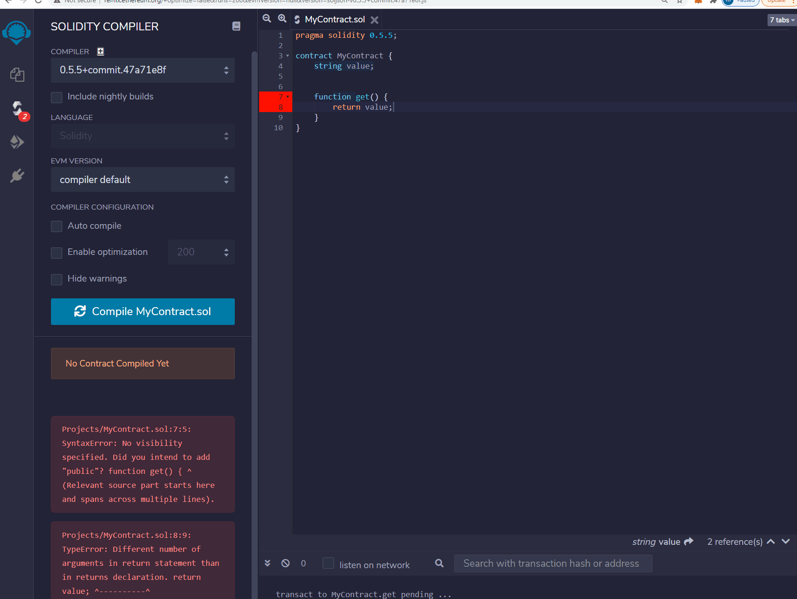

# SamartContractsStructures
----

### My First Contract
Still pending........

I am trying to simplify solidity and show how to build it step by step. 
I am using Dapp University and freeCodeCamp.org to build the building blocks step by step. 

----
### How to find errors and how to solve them?

The above Gif Image shows once you compile the above simple, smart contract, you get errors in lines 7 and 8. Line 7 says 

#### " Did you intend to add "public" ? function get() 

This means we need to add "public." or if it is private we can add "private" after the get().

But its still give an error on line 8.

The error says,

The above error means there are many arguments, which means the solidity compiler didn't know the return value is a string, integer, etc.( VAR), So we need to change that public returns(string) as show below, but still it gives an warning.

 

and the warning says,

This simply means we cant view the string value after we deply it, so we add ##view 

